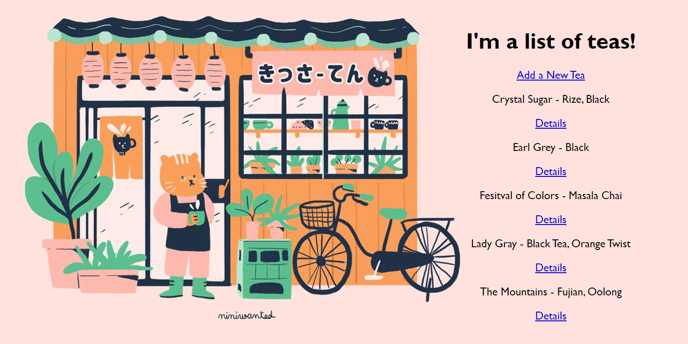

# Welcome to the Tea Shop

This project was to build an app that will allow the employees of the tea shop to manage the different teas that the shop sells.

## Project Setup

* Clone down the repo and `cd` into it

* Change this from a git repo to a regular directory:
  * `rm -rf .git`

* Create a new repository on Github and make your first commit with this boilerplate code:
  * Create a brand new repository under your account on Github
  * `git init`
  * `git add .`
  * `git commit -m "First commit with boilerplate code"`
  * `git remote add origin your-new-repos-ssh-remote-url`
  * `git push -u origin master`

* Create your OSX/Linux OS virtual environment in Terminal:

  * `python -m venv teashopenv`
  * `source ./teashopenv/bin/activate`

* Install the app's dependencies:

  * `pip install -r requirements.txt`

* All your models and migrations have already been created, so ahead and run migrations:

  * `python manage.py migrate`

* Create a superuser for your local version of the app:

  * `python manage.py createsuperuser`

* Populate your database with initial data from fixtures files: (_NOTE: every time you run this it will remove existing data and repopulate the tables_)

  * `python manage.py loaddata teas`
  * `python manage.py loaddata packagings`
  * `python manage.py loaddata tea_packagings`

* Make a copy of `teaapp/views/connection.py.example` and remove the `.example` extension and change the path to the database 

* Fire up your dev server and get to work!

  * `python manage.py runserver`

## Features

1. When a user navigates to the root URL of the application (`/`), they should see a list of all the teas in alphabetical order.

1. Above the list of teas, provide a link that presents the user with a form to add a new tea by providing the name and flavor. When the form is submitted, the user should be directed to `/` and should see the newly added tea in the list.

1. Add a link to view the details of each tea for every item on the list of teas. When the user clicks on this link, they should see the name of the tea, the flavor, the names of the many packaging methods that are available for that tea and the longevity of each packaging method for that specific tea.

1. Add a DELETE button next to each packaging method listed on the details page for a tea. When the user clicks this button, that packaging method should be deleted for that tea. **This action should not delete the packaging itself!**

1. Add an EDIT button at the bottom of the tea details page. When the user clicks on the button, they should be presented with a form that lets them edit only the flavor of the tea. 
